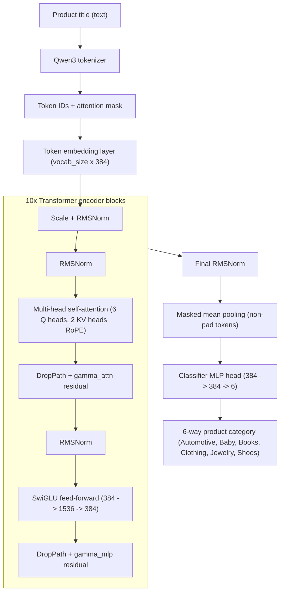

## EmbeddingClassifier Architecture

`category_classification/embedding_classifier.py` implements the compact
encoder used for the best LSPC run (test macro-F1 0.9315 / accuracy 0.9487).
It is a bidirectional, RoPE-enabled transformer stack with a small MLP head
and ~80M parameters (dominated by the embedding matrix).

### Best-Run Setup (LSPC V2020, Nov 2025)
- Tokenizer: `Qwen/Qwen3-Embedding-0.6B` (pad-right, pad id injected if absent).
- Backbone: 10 blocks, hidden size 384, 6 query heads with 2 grouped kv heads,
  RoPE on q/k, DropPath linearly scaled 0 -> 0.1, residual gammas init at 1e-2.
- MLP: SwiGLU with 4x expansion (1536 hidden) in every block.
- Pooling: mask-aware mean over tokens (no CLS token).
- Head: 2-layer MLP (dropout 0.1 -> Linear 384->384 -> GELU -> dropout 0.1 -> Linear
  384->6). The V2 variant swaps this for a residual RMSNorm bottleneck head but
  keeps the same backbone.
- Precision: FP32 weights; training typically uses CUDA AMP via `--amp`.

### Model Scheme

### Component Notes

- **Embeddings**: token embedding matrix sized `vocab_size x hidden_size`,
  scaled by `sqrt(hidden_size)` and normalised with RMSNorm before entering the
  stack; optional embedding dropout.
- **Attention**: bidirectional multi-head attention with grouped key/value
  heads (`num_attention_heads` can exceed `num_key_value_heads`); RoPE is
  applied to q/k; only a padding mask is used (no causal mask).
- **Stability**: RMSNorm everywhere, DropPath increasing per layer (`max_drop_path=0.1`
  default), and learnable residual scales (`gamma_attn`, `gamma_mlp`, init 1e-2).
- **Pooling**: mean pooling respects the attention mask; no special CLS token.
- **Classifier heads**:
  - Baseline (default): dropout -> Linear -> GELU -> dropout -> Linear to logits.
  - V2 (`embedding_classifier_v2.py`): RMSNorm -> Linear -> GELU -> dropout ->
    Linear -> optional residual -> RMSNorm -> dropout -> logits, with configurable
    bottleneck width and dropout.

### Precision and Training

- Training scripts accept `--amp` to enable `torch.amp.autocast` + `GradScaler`
  on CUDA; checkpoints store FP32 weights plus optimizer/RNG state.
- `train_embedding_classifier.py` covers the baseline head; the V2 trainer adds
  label smoothing, focal loss, and head regularisation (`classifier_hidden`,
  `classifier_dropout`, `classifier_residual`). Resume from any
  `checkpoint-epochX.pt` via `--resume`.
